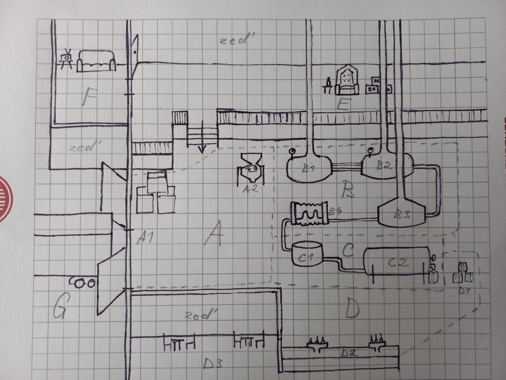

# Branický pivovar
Tato oblast je středobodem hry a hráč se sem často vrací.

## Stavy scény
- Při první návštěvě v havarijním stavu, přístupná jen malá část
- Opravení - ale stále celkem prázdný
- Lze dokoupit stroje na výrobu piva
	- U nich pracují NPC, které lze naverbovat v průběhu misí

## Koncept

### A - Sklad

Zde se skladuje a kontroluje dovezený chmel a slad (A1). Zároveň se začne zpracovávat ve šrotovníku (A2). V této oblasti se nejčastěji pohybuje *kvalitář* (pracovní název, dále skladník, chmelař). Ten chodí od vrat, kde přebírá nové zásilky, kolem krabic, ke šrotovníku.

### B - Varna

Slad se zde dostane do různých kádí a pánví (B1, B2, B3). Po pěkném povaření se nechá vychladit v chladiči mladiny (B4). Toto je revír *pivovarníka*, který se stará o hladký průběh vaření. Pobíhá od stroje ke stroji a kontroluje různé ciferníky.

### C - Kvasírna

V kvasírně nepřekvapivě pivo kvasí. To se děje ve kvasné kádi (C1), ze které se pivo dostane do ležáckého tanku (C2). Vedle kvasné kádi klidně odpočívá *kvasník*.

### D - Výčep

Z ležáckého tanku se pivo stáčí do sudů (D1), které budou buď vyexpedované nebo poputují hned k blízkému výčepu (D2). U výčepu stojí *hospodský* a obsluhuje hosty. Na spodu obrazovky by mohla být vidět i malá část hospody (D3) se štamgasty.

### E - Ochoz

Vyvýšená plošina s baronovo trůnem, který má výhled na pivovar. Z pohledu hráče je trůn mezi komíny kádí.

### F - Odpočinková místnost

Sem chodí zaměstnanci čas od času si odpočnout. Je v ní rádio, ze kterého hraje Brána song.

### G - Parkoviště pro kamiony

Místo, kde parkují kamiony se surovinami. Hráči nepřístupná oblast. Kamion periodicky nacouvá k vratům, otevře dveře a po chvíli je zas zavře a odjede.

### Poznámky ke konceptu

- ~~Pravá stěna není vůbec vymyšlená.~~
- ~~E - Ochoz je celkem prázdný~~.
- ~~Dolní stěna je celkem nedomyšlená, možná by chtěla změnit.~~
- ~~Východ k misím není v konceptu. Mohl by být vpravo od trůnu, tedy by kolem něj hráč musel projít než vyrazí na misi. Nebo u výčepu a tedy by hráč jakoby odcházel přes hospodu (hospoda není součástí hry).~~
- Nějak naznačit, kde je východ k misím. Například pomocí cedulí únikový východ.
- ~~Trubky spojující kádě aj. by měly být nejlépe hodně při zemi, aby hráči neblokovaly v pohybu.~~
- ~~Šrotovník tam nemusí být. Pokud tam bude, může šrot padat na pás a ten ho převeze do první kádi.~~

### Reference

[Brewery research](https://william-gamesdesign.blogspot.com/2013/01/brewery-research.html "https://william-gamesdesign.blogspot.com/2013/01/brewery-research.html") 

[Dishonored - industrial interiors](https://william-gamesdesign.blogspot.com/2013/01/dishonored-research-industrial-interiors.html "https://william-gamesdesign.blogspot.com/2013/01/dishonored-research-industrial-interiors.html")

## Zaměstnanci

### Skladník

Chodí od vrat, přes krabice, ke šrotníku. Tam čeká, dokud nepřijede kamion. Pak jde k vratům a cyklus se opakuje. Tím simuluje vyskladňování. Často chodí do odpočinkové místnosti.

### Pivovarník

Chaoticky přebíhá od kádě ke kádi a kontroluje, jestli je vše v pořádku. Občas odejde do odpočinkové místnosti poslouchat rádio.

### Kvasník

Jen odpočívá na lehátku, stejně jako pivo odpočívá v kádi. S ničím si nedělá starosti a na jakékoliv popohnání reaguje flegmaticky a že to chvíli ještě počká nebo že to potřebuje uležet. Nikam nechodí. Baron ho podezřívá, že nepracuje.

### Hospodský

Většinu času postává u výčepu a obsluhuje hosty. Zřídkakdy odejde do odpočinkové místnosti.