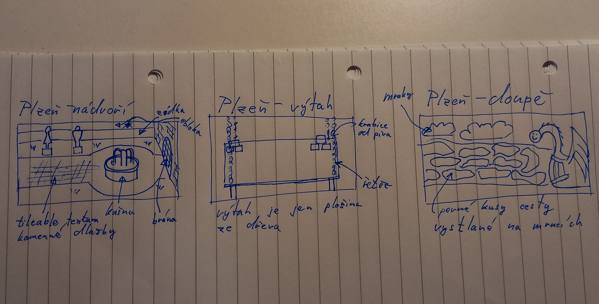

# Plzeňský pivovar
Honosná, až královská oblast. Osídlená rytíři (nepřátelé).

## Oblasti
### Nádvoří
- V pozadí sochy využité k hádance
- Kamenná dlažba
- Napravo levelu je zavřená brána
- Oblast bez nepřátel před náročným koncem
- Nepřátelé:
	- ~~Snobové/šlechta - jednoduší nepřátelé, lehké útoky~~
- Objekty:
	- Kašna
	- Sochy
	- Hromada flašek od piva poblíž soch
#### Hádanka
- V pozadí jsou 4 sochy
	- Fiťák, Surfař, Pavoučí muž a Rytíř (nepřátelé z misí)
- Každá socha má ruku nastavenou tak, aby v ní mohla držet pivo
- Při interakci se sochou je hráči nabídnuto soše dát flašku od piva (Únětice, Staropramen, Starobrno nebo Plzeň)
- Hráč musí každé soše přiřadit správné pivo a to odemkne bránu

### Výtah
- Jede do nebe
- Hratelná oblast akorát na obrazovku
- Náročná oblast před bossfightem
- Nepřátelé:
	- Plzeňští rytíři - pomalí a silní
	- ~~Pivonoši (Zbrojnoši) - podpora rytířů, rychlí a slabí~~
- Objekty:
	- Krabice/bedny piva ~~(rozbitelné)~~
	- Velké bedny od piva, ze kterých vylézají nepřátelé

### Dračí doupě
- V oblacích
- Honosné, rozsáhlé, prostorné ale prázdné (bez nepřátel)
	- To dá hráči čas se připravit na finální boss fight
- Boss: Drak
	- Místo břicha má sud
	- Vaří se pivo na dračím ohni?
	- Nebo místo toho chrlí pivo
	- Hráč mlátí do sudu a snaží se ho rozbít
	- Ze sudu se pak vyleje pivo a drak umře

## Koncept
