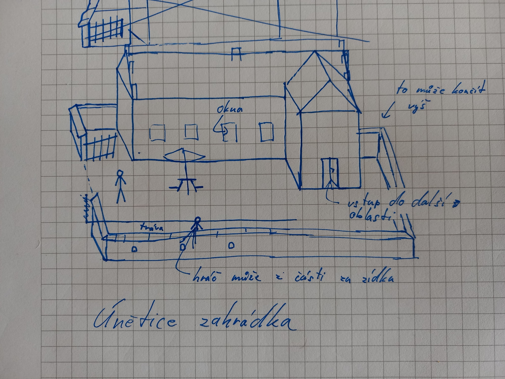
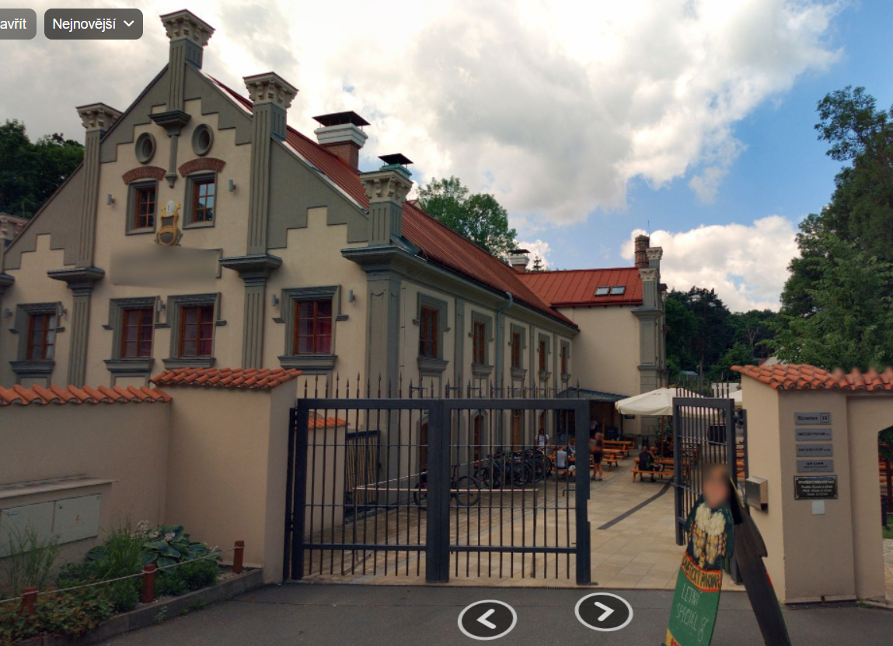
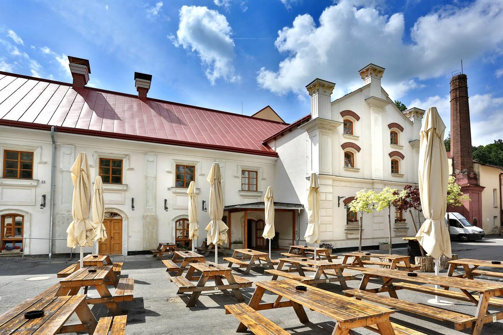
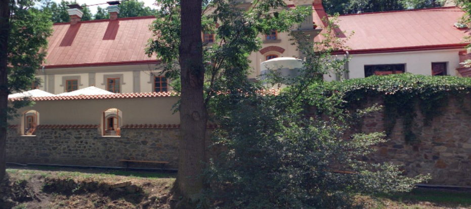
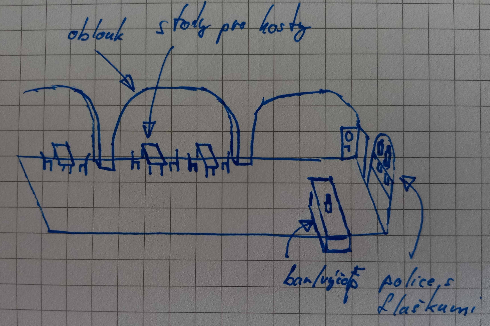
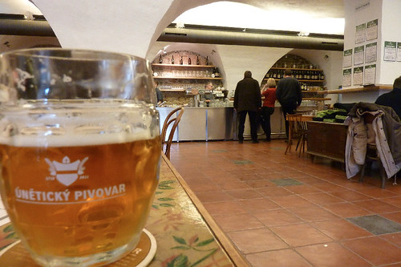
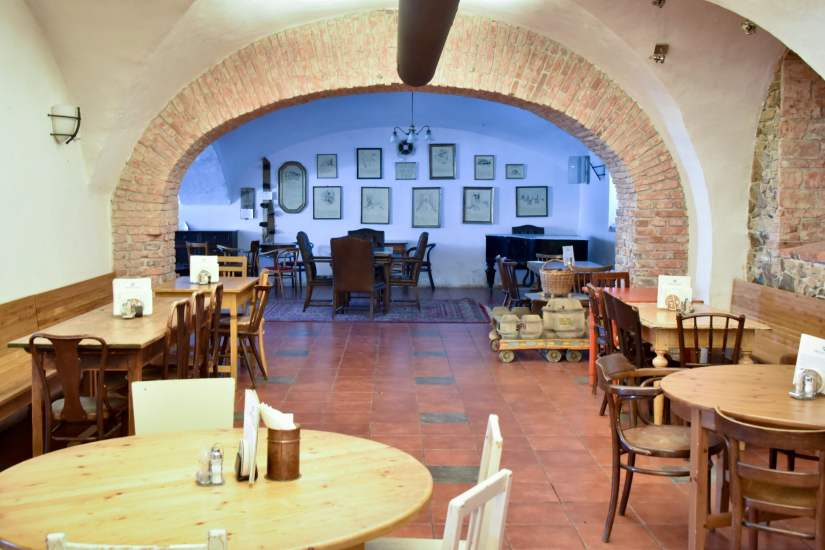
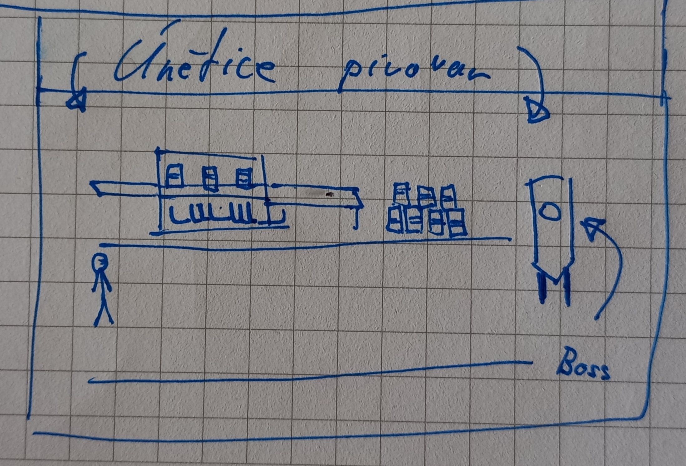
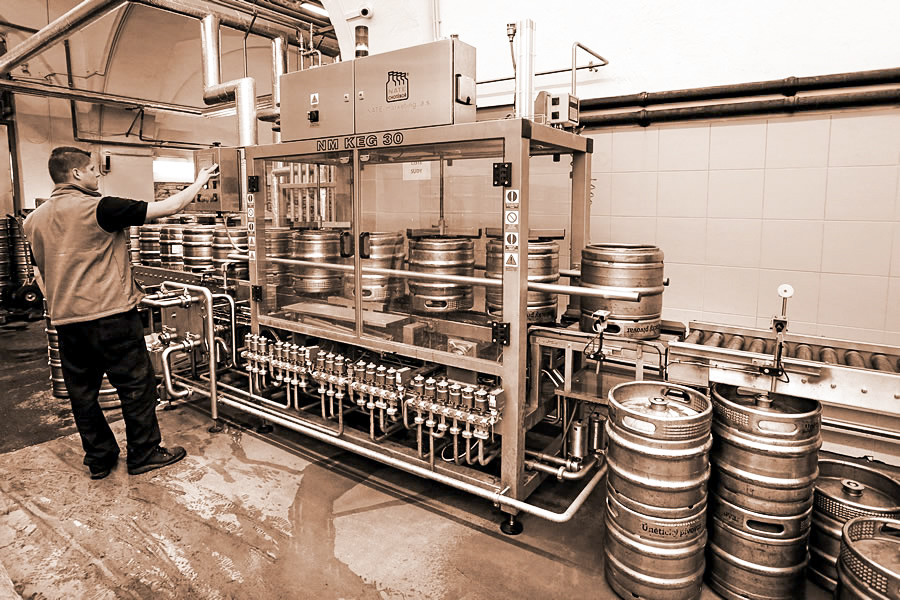

# Únětický pivovar
Tato scéna je první v celé hře a slouží zároveň jako tutoriál. Části mise jsou krátké, jejich délka je 1-2 délky obrazovky. 

## Části

### Zahrádka hospody
- Venkovní posezení
- V pozadí pivovar, se vstupem dovniř vpravo scény.
- Hráč se zde naučí používat lehký útok.
- Nepřátelé:
	- FIŤáci sedící a popíjející - nebrání se, nepohybují se, není nutné je porazit
- Objekty:
	- Lavice k posezení (rozbitelné)

#### Koncept

  

Koncept zahrádky. Level by měl být delší tak, že dveře do hospody nejsou na začátku vidět.  
Reference:

  

Pohled na bránu a vnějšek pivovaru.  

  

Jiný pohled na vnějšek pivovaru.  

  

Zídka, která bude pod oblastí, kde se může hráč pohybovat.  

### Hospoda

- Hráč se zde naučí používat těžký útok.
- Nepřátelé:
	- Děti - pobíhající, nebránící se, jedno má klíč, kterým hráč odemkne dveře
- Objekty:
	- Stoly pro hosty (rozbitelné)

#### Koncept

  

Koncept vnitřku hospody. Oblouků tam může být více, ať je to delší. Napravo jsou dveře, vstup do pivovaru. Stoly by neměly bránit hráči v pohybu, proto jsou pouze u horní stěny. Na baru by měl být výčep.  

Reference:  

  

  

### Pivovar

- Boss - Fermentační tank
	- Výchozí pozice je napravo obrazovky
	- Útok: přeběhne do leva mimo obrazovku a pak se vrátí doprava
		- Prvním proběhnutím ohrozí spodní polovinu oblasti a při návratu ohrozí horní polovinu. Nebo naopak (náhodně)
- Objekty:
	- Různé boilery/tanky/nádrže pro vaření piva - v pozadí, nerozbitné

#### Koncept

  

Při vstupu do pivovaru by hráč neměl vidět fermentační tank (boss).

  

Návrh, co by mohlo být v pozadí.

## ~~Návrh NPC~~

* ~~Znuděný číšník~~
* ~~Host, kterého chaos kolem něj vůbec nezajímá~~
* ~~Pivovarník~~