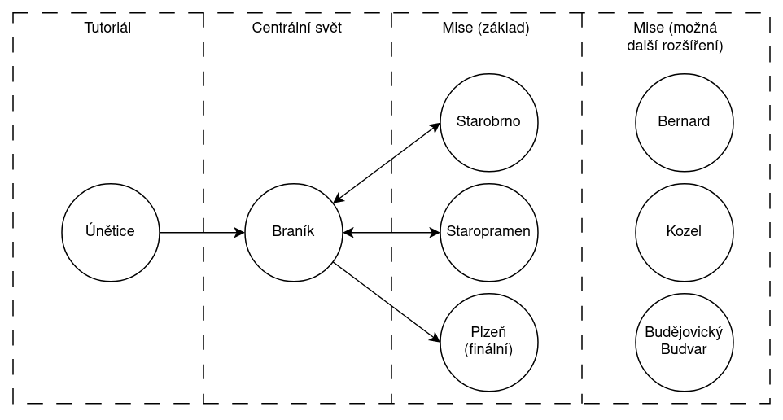

# Zasazení
Hra se odehrává v současnosti v Česku. Středobod našeho světa je Branický pivovar, do kterého se hráč během hraní několikrát vrátí. Majitel Braníku, Baron Branický, je znepokojen s úpadem jeho pivovaru a proto se rozhodne zničit konkurenci.

# Scény

Hra započne v Úněticích. Pak se hráč poprvé dostane do Braníku. Odtud si může vybrat mise, bude mít odemčené Starobrno a Staropramen (popřípadě další). Tyto mise může absolvovat v jakémkoliv pořadí. Po splnění všech misí se hráči odemkne Plzeň. Mise lze absolvovat pouze jednou a do jejich scén se nejde vracet. 

## [Branický pivovar](Scény/Branický%20pivovar.md)

Při první návštěvě Braníku hráč spatří zpustošený pivovar. V průběhu hry ho hráč opraví, bude ho vylepšovat a získávat zaměstnance. Tento pivovar bude velký prostor, kde hráč bude mít, na rozdíl od misí, volnost v horizontálním pohybu.

Pivovar bude osídlen NPC pracovníky, které může hráč převést na svou stranu v misích. Pracovníci mají přiřazeno několik pracovišť, mezi kterými přecházejí a pracují. Pokud hráč naverbuje pracovníka, pro kterého nemá stanoviště, tak daný pracovník tam bude jen tak stát. 

## [Únětice](Scény/Únětice.md)

Zde celý příběh započne. Baron je zde vyprovokován tak, že přesvědčí hráče všechno zničit. Scéna je rozdělená na tři části: zahrádka hospody, hospoda a pivovar. Hráč se v průběhu mise učí ovládání a vše vyústí v jednoduchý boss fight s oživlým sudem (změna bosse vyhrazena).

## [Starobrno](Scény/Starobrno.md)

Hlavní část mise bude v tunelu/katakombách vedoucích z Prahy až pod Brněnský pivovar. Tunel byl vybudován jako součást tajného plánu na zničení konkurence, který hráč dokončí. Úkolem tedy je pokládat bomby na podpůrné sloupy, které budou na konci mise odpáleny a Starobrno bude srovnáno se zemí (možná bude i o trochu níž).

## [Staropramen](Scény/Staropramen.md)

V misi staropramen se nehraje na žádné tajnůstky. Hráč vstoupí do pivovaru hlavními dveřmi a začne vše ničit. Staropramen je ale vlastněn Číňany a ti téměř vše automatizovali. Po pivovaru se tedy pohybují roboti, kteří ho zároveň brání. 

## [Plzeň](Scény/Plzeň.md)

Toto je finální část plánu, jak zajistit monopol Braníku. Plzeňský pivovar je královský a honosný.
\<Doplnit detaily mise>
Mise končí soubojem s drakem
